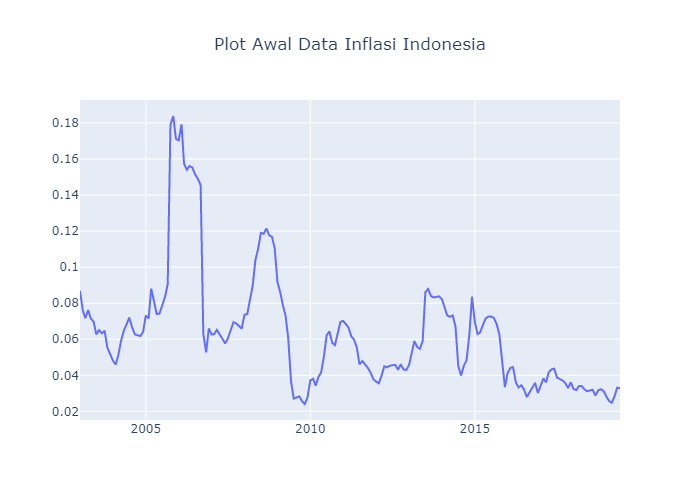
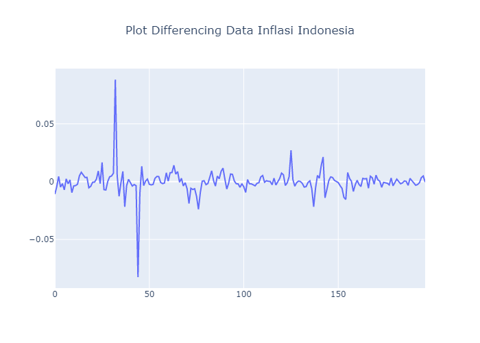

Hai...kali ini kita akan menganalisis data inflasi Indonesia dari Januari 2003 sampai Juni 2019. Nantinya kita akan menggunakan data ini untuk membuat model dan memprediksi inflasi Indonesia pada Juli 2019 sampai Desember 2019. Data yang akan digunakan untuk membentuk model dapat teman-teman temukan [di sini](https://github.com/Rangga1708/analisis-data-inflasi-indonesia/blob/master/data_inflasi_indonesia_train.xlsx) sedangkan data inflasi Indonesia pada bulan Juli 2019 sampai Desember 2019 yang sebenarnya juga ada [di sini](https://github.com/Rangga1708/analisis-data-inflasi-indonesia/blob/master/data_inflasi_indonesia_test.xlsx). Untuk syntax Python dapat teman-teman temukan **di sini**.

Analisis data kali ini berbeda dengan yang sudah kita lakukan sebelumnya. Pada analisis data motor trend US, kita menggunakan analisis regresi linear sederhana. Tetapi untuk analisis data inflasi ini, kita akan menggunakan analisis runtun waktu (time series). Mengapa kita tidak menggunakan analisis regresi linear sederhana? Karena data inflasi ini nilainya hanya bergantung pada data waktu sebelumnya dan diasumsikan tidak ada variabel lain yang mempengaruhi inflasi, walaupun pada kenyataannya ada faktor ekonomi yang mempengaruhinya. Sebagai contoh, inflasi pada bulan Juni 2019 nilainya bergantung pada inflasi pada bulan Mei 2019 (bisa saja bergantung pada inflasi bulan sebelumnya lagi). Inilah mengapa analisis ini dinamakan analisis runtun waktu karena nilainya hanya bergantung pada nilai di waktu sebelumnya.

Pertama saya akan mengimport beberapa modules python yang saya butuhkan. Modules yang akan saya gunakan adalah sebagai berikut:
```Python
#import modules
import numpy as np
import pandas as pd
import plotly.graph_objs as go
import matplotlib.pyplot as plt
import statistics as stat
from statsmodels.tsa.stattools import adfuller, acf, pacf
from statsmodels.graphics.tsaplots import plot_acf, plot_pacf
from statsmodels.tsa.arima_model import ARIMA
from scipy.stats import shapiro
from statsmodels.sandbox.stats.runs import runstest_1samp
```

## Asumsi Awal
Pada analisis runtun waktu, asumsi awal yang harus dipenuhi adalah ***stasioneritas*** data terhadap mean atau dengan kata lain mean dari data haruslah konstan. Perhatikan plot data awal berikut:
```Python
#import data
data_inflasi_train = pd.read_excel('data_inflasi_indonesia_train.xlsx')

#ubah urutan data
data_inflasi_train = data_inflasi_train.iloc[::-1].reset_index(drop = True)

#tentukan sumbu x dan y line plot
waktu = data_inflasi_train['Month']
inflasi = data_inflasi_train['Inflasi']

#buat line plot
plot_inflasi = go.Scatter(
    x = waktu,
    y = inflasi,
    mode = 'lines'
)

#atur layout
layout = {
    'title' : {
        'text' : 'Plot Awal Data Inflasi Indonesia',
        'x' : 0.5
    }
}

#buat figure
fig = go.Figure(data = plot_inflasi, layout = layout)

#tampilkan plot
fig.show()
```


Dari plot di atas, ternyata data tidak stasioner terhadap mean karena plot tersebut membentuk bukit dan jurang yang cukup terjal. Kita juga dapat melakukan uji hipotesis menggunakan ADF Unit Root Test dengan hipotesis nol data tidak stasioner terhadap mean. Hipotesis nol ditolak jika p-value < 0.05.
```Python
#hitung p-value adf test
result = adfuller(inflasi, autolag='AIC')
print('P-value :',result[1])
```
`P-value : 0.38987669092034716`

Karena p-value > 0.05, maka hipotesis nol tidak ditolak sehingga dapat disimpulkan bahwa data tidak stasioner terhadap mean.

Jika data tidak stasioner terhadap mean, maka analisis runtun waktu tidak dapat dilakukan. Untuk mengatasi masalah tersebut, kita perlu mentransformasi data terlebih dahulu. Kita akan coba lakukan ***differencing*** data (menghitung selisih data pada waktu ke-t dengan ke-t+1) dan melihat plotnya. 
```Python
#tentukan sumbu x dan y line plot
waktu = data_inflasi_train['Month']
inflasi = data_inflasi_train['Inflasi']

#buat line plot
plot_inflasi = go.Scatter(
    x = waktu,
    y = inflasi,
    mode = 'lines'
)

#atur layout
layout = {
    'title' : {
        'text' : 'Plot Awal Data Inflasi Indonesia',
        'x' : 0.5
    }
}

#buat figure
fig = go.Figure(data = plot_inflasi, layout = layout)

#tampilkan plot
fig.show()
```


Dari plot di atas, terlihat bahwa data berada di sekitar garis y=0. Artinya data sudah stasioner terhadap mean. Untuk meyakinkan, kita lakukan ADF Unit Root Test kembali.
```Python
#hitung p-value adf test
result = adfuller(inflasi_diff, autolag='AIC')
print('P-value :',result[1])
```
`P-value : 6.303998805804485e-09`

Karena p-value < 0.05, maka hipotesis nol ditolak sehingga dapat disimpulkan bahwa data stasioner terhadap mean. Dengan demikian, analisis runtun waktu dapat dilakukan. Akan tetapi, perlu diingat bahwa data yang akan kita gunakan adalah data differencing.
